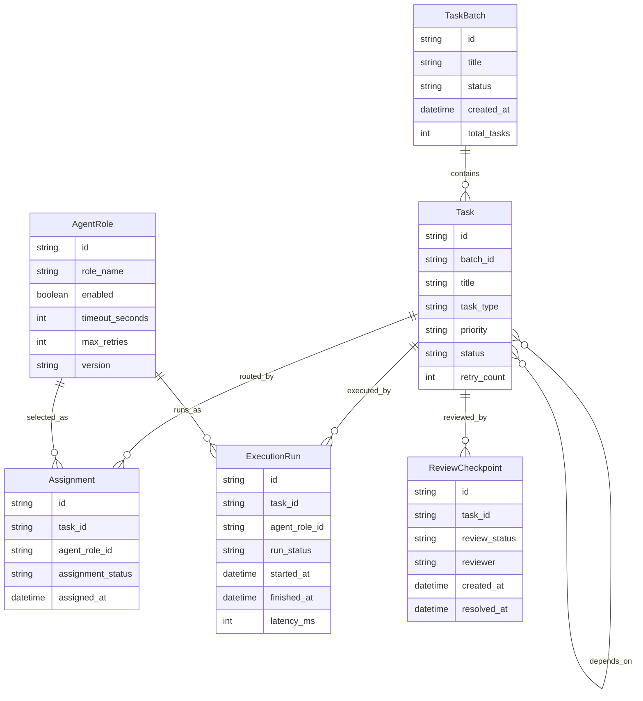

# TaskForge Domain Model

## Goal
Clarify the system's core entities before implementation so task routing, execution, and review all map to explicit domain objects.

## Design Principles
- `TaskBatch` is the user-facing submission boundary.
- `Task` is the smallest schedulable work unit.
- `AgentRole` describes a registered execution capability, not a specific runtime instance.
- `Assignment` captures routing decisions.
- `ExecutionRun` captures each concrete attempt to execute a task.
- `ReviewCheckpoint` captures human-in-the-loop control points.
- State changes should be recorded on the object that owns that lifecycle stage.

## Entity Definitions

### TaskBatch
Represents a batch of tasks submitted by a user in one request.

Creation:
- Created when a user submits a new batch.

End of lifecycle:
- Ends when all tasks are completed, failed terminally, cancelled, or the batch is archived.

Core fields:
- `id`: unique batch identifier.
- `title`: short human-readable name.
- `description`: batch-level context or goal.
- `created_by`: submitter identity.
- `created_at`: submission timestamp.
- `status`: current batch state.
- `total_tasks`: number of tasks in the batch.
- `metadata`: free-form batch context.

Suggested statuses:
- `draft`
- `submitted`
- `in_progress`
- `waiting_review`
- `completed`
- `failed`
- `cancelled`
- `archived`

Notes:
- `TaskBatch.status` is derived from the aggregate state of its tasks plus any review gates.

### Task
Represents one concrete unit of work inside a batch.

Creation:
- Created as part of batch ingestion or as a derived task from orchestration.

End of lifecycle:
- Ends when the task is completed, cancelled, or marked terminally failed.

Core fields:
- `id`: unique task identifier.
- `batch_id`: owning batch.
- `title`: short task name.
- `description`: detailed work description.
- `task_type`: category such as `generate`, `analyze`, `review`, `transform`.
- `priority`: scheduling priority.
- `status`: current task state.
- `input_payload`: structured task input.
- `expected_output_schema`: schema or contract for task output.
- `assigned_agent_role`: preferred or current role name.
- `dependency_ids`: upstream task identifiers.
- `retry_count`: number of attempts already consumed.
- `created_at`: creation timestamp.
- `updated_at`: last mutation timestamp.

Suggested statuses:
- `pending`
- `ready`
- `assigned`
- `running`
- `waiting_review`
- `completed`
- `failed`
- `cancelled`
- `blocked`

Notes:
- `Task.status` is the main coordination state for orchestration.
- Dependencies gate transition from `pending` to `ready`.

### AgentRole
Represents a registered executor capability.

Creation:
- Created when a role is registered in the system.

End of lifecycle:
- Typically does not end; roles are versioned and may be disabled or superseded.

Core fields:
- `id`: unique role identifier.
- `role_name`: stable role name.
- `description`: what the role does.
- `capabilities`: supported actions or tools.
- `input_schema`: accepted input contract.
- `output_schema`: produced output contract.
- `timeout_seconds`: default timeout per run.
- `max_retries`: retry budget recommendation.
- `enabled`: whether the role can receive new assignments.
- `version`: semantic or internal version string.

Notes:
- `AgentRole` is reference data used by `Assignment` and `ExecutionRun`.
- Versioning matters when execution behavior changes over time.

### Assignment
Represents the routing decision that a task should be handled by a specific role.

Creation:
- Created when the scheduler or router picks a role for a task.

End of lifecycle:
- Ends when the assignment is fulfilled, replaced, cancelled, or expires.

Core fields:
- `id`: unique assignment identifier.
- `task_id`: assigned task.
- `agent_role_id`: selected role.
- `routing_reason`: explanation for why the role was chosen.
- `assigned_at`: timestamp of routing.
- `assignment_status`: current assignment state.

Suggested statuses:
- `proposed`
- `active`
- `superseded`
- `expired`
- `cancelled`
- `fulfilled`

Notes:
- A task may have multiple assignments over time, but only one active assignment at a time.

### ExecutionRun
Represents one concrete execution attempt for a task by a role.

Creation:
- Created when an assigned role starts or is about to start processing the task.

End of lifecycle:
- Ends when execution succeeds, fails, times out, or is cancelled.

Core fields:
- `id`: unique run identifier.
- `task_id`: target task.
- `agent_role_id`: role used for this run.
- `run_status`: current execution state.
- `started_at`: run start timestamp.
- `finished_at`: run end timestamp.
- `logs`: execution logs or trace summary.
- `input_snapshot`: immutable copy of run input.
- `output_snapshot`: immutable copy of produced output.
- `error_message`: failure reason, if any.
- `token_usage`: usage accounting for LLM-backed runs.
- `latency_ms`: run duration in milliseconds.

Suggested statuses:
- `queued`
- `running`
- `succeeded`
- `failed`
- `timed_out`
- `cancelled`

Notes:
- Each retry should create a new `ExecutionRun`.
- Execution telemetry belongs here, not on `Task`.

### ReviewCheckpoint
Represents a human approval or intervention point.

Creation:
- Created when the system requires manual review due to policy, confidence, risk, or explicit workflow design.

End of lifecycle:
- Ends when the checkpoint is approved, rejected, or otherwise resolved.

Core fields:
- `id`: unique checkpoint identifier.
- `task_id`: related task.
- `reason`: why review is required.
- `review_status`: current review state.
- `reviewer`: person or group handling the checkpoint.
- `review_comment`: decision or feedback.
- `created_at`: checkpoint creation timestamp.
- `resolved_at`: resolution timestamp.

Suggested statuses:
- `pending`
- `approved`
- `rejected`
- `waived`

Notes:
- A task may have zero or many review checkpoints across its lifetime.

## Relationships
- One `TaskBatch` has many `Task`.
- One `Task` belongs to one `TaskBatch`.
- One `Task` may depend on many other `Task`.
- One `Task` may have many `Assignment`.
- One `Assignment` points to one `AgentRole`.
- One `Task` may have many `ExecutionRun`.
- One `ExecutionRun` uses one `AgentRole`.
- One `Task` may have many `ReviewCheckpoint`.

## Lifecycle Mapping
- User submission creates `TaskBatch` and one or more `Task`.
- Scheduler decision creates or updates `Assignment`.
- Execution attempt creates `ExecutionRun`.
- Manual intervention creates `ReviewCheckpoint`.
- Batch-level progress is reflected in `TaskBatch.status`.

## State Change Ownership
- Submission and aggregate completion belong to `TaskBatch`.
- Scheduling and execution coordination belong to `Task`.
- Routing decisions belong to `Assignment`.
- Attempt-level telemetry belongs to `ExecutionRun`.
- Human decisions belong to `ReviewCheckpoint`.
- Executor capability changes belong to `AgentRole`.

## Mermaid ER Diagram

